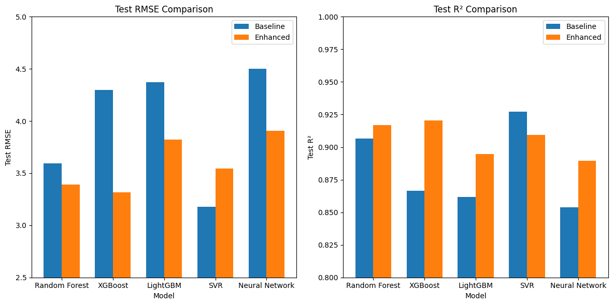

# IU INTERNATIONAL UNIVERSITY OF APPLIED SCIENCES

### Thesis: Synthetic Data using Large Language Model for Laser-Accelerated Ion Beams (LAIB)

## Abstract
The thesis investigates the efficacy of large language models in generating synthetic data for LAIB research. By evaluating various models and techniques, the study demonstrates how synthetic data can be used to enhance research in areas plagued by data scarcity.

**Keywords:** Large Language Models (LLMs), Synthetic Data Generation, Laser-Accelerated Ion Beams (LAIBs), Prompt Engineering, Data Analysis

## Purpose
This repository hosts the code, data, and analysis used for generating synthetic data for Laser-Accelerated Ion Beams (LAIB) using large language models (LLMs). The project aims to explore the potential of LLMs in addressing data scarcity issues in LAIB research by creating high-quality synthetic datasets.

## Original Dataset Overview - Laser-Accelerated Ion Beam Data
This LAIB dataset (`1_sample_preparation/source/d_full_clean.csv`), used in this study is a compilation of the results from multiple studies. Overall the data from these various sources is not homogeneous in terms of the quality. The research of Bach-Ptaszek, (2024) study performed the cleaning of these datasets and unified it into the one used here. The experimental data originates from the following sources: 
Brenner et al., 2011; Busold, 2014; Fang et al., 2016; Flacco et al., 2010; Flippo et al., 2008; Fuchs et al., 2006; Gao, n.d.; Grishin, 2010; Hornung et al., 2020; Noaman-ul-Haq et al., 2018; Pirozhkov et al., 2010; Robson et al., 2007; Steinke et al., 2020; Zeil et al., 2010; Zepf et al., 2001; Zulick et al., 2013


## Experimental Design
### Layout
The experimental design involves detailed exploratory data analysis (EDA) and comprehensive preparation to enhance the dataset’s reliability for generating synthetic data:

#### TSNA Mechanism
Visual depiction of the Target Normal Sheath Acceleration (TNSA) mechanism, illustrating its fundamental processes and applications.


#### Experimental Design
Diagram detailing the setup used in LAIB experiments, highlighting major components and their interconnections.


#### History of LLMs
Timeline showing the evolution of Large Language Models, marking significant milestones and developments.


#### Process Overview
Flowchart outlining the steps involved in the generation and evaluation of synthetic data using LLMs.


#### Prompt Design
Schematic of the different prompting strategies employed in the thesis to optimize synthetic data generation.


#### Evaluation of Synthetic Data using ML Models
Graphical representation of the methods used to evaluate the quality and efficacy of the generated synthetic data.


## Model Training on Synthetic Data
The models were trained on synthetic data generated by various LLMs listed below, employing different prompt engineering techniques to ensure the creation of realistic and representative synthetic datasets.

## Models Employed in the Study

- **Claude 3.5 Sonnet**: Provided by Anthropic.
- **Claude 3 Sonnet**: Provided by Anthropic.
- **Gemma 7b**: Provided by Ollama.
- **GPT-3.5 Turbo**: Provided by OpenAI.
- **GPT-4o**: Provided by OpenAI.
- **Llama2 13b**: Provided by Ollama.
- **Llama3 8b**: Provided by Ollama.
- **Llama3 70b**: Provided by Ollama.
- **Mistral 7b**: Provided by Ollama.
- **Mixtral 8x22b**: Provided by Ollama.
- **Phi3 Medium 128k**: Provided by Ollama.
- **Phi3 Mini 128k**: Provided by Ollama.

In the thesis, a variety of prompting methods were employed to optimize the generation of synthetic data using large language models. These methods included Chain of Thought (CoT), Skeleton of Thought (SoT), Self Consistency (SC), Generated Knowledge (GK), Least to Most (LTM), Chain of Verification (CoV), Step Back Prompting (SBP), Rephrase and Respond (RaR), Emotion Prompt (EM), Directional Stimuli (DS), Recursive Criticism and Improvement (RCAI), and Reverse Prompting (RP). Each technique was chosen to enhance the models' ability to accurately simulate complex laser-accelerated ion beam data.

## How to Get Started
### Dependencies
Ensure all dependencies are installed by running:
```bash 
pip install -r requirements.txt
```

For utilizing LLMs, rename `.env.bkp` to `.env` and insert the necessary API keys.

## Results Summary
This section provides a detailed summary of the key performance metrics evaluated in the thesis, focusing on KL-Divergence distance, Wasserstein distance, Maximum Mean Discrepancy (MMD), and hypothesis testing outcomes for multivariate KL-Divergence and Kolmogorov-Smirnov tests, along with the performance of machine learning models trained on synthetic data.

### Top Performing Metrics
- **KL-Divergence Distance**: The Claude 3.5 Sonnet model with Self-Consistency prompting reported the lowest KL-Divergence, suggesting a highly accurate synthetic generation closely mirroring the original data distribution. This model's performance underscores its effectiveness in capturing the complex statistical properties of the LAIB dataset.
- **Wasserstein Distance**: Claude 3.5 Sonnet with Self-Consistency prompting also showed the smallest Wasserstein distance, indicating its superior capability in modeling the earth mover's distance between the synthetic and original data distributions.
- **Maximum Mean Discrepancy (MMD)**: Again, the Claude 3.5 Sonnet with Self-Consistency achieved the best performance, indicating minimal discrepancies in mean comparisons across all kernels, reinforcing the model’s accuracy in representing the original data's multivariate relationships.

### Hypothesis Testing Results
- **Multivariate KL-Divergence Test**: For the synthetic datasets generated by Claude 3.5 Sonnet using Self-Consistency prompting, the multivariate KL-Divergence test often failed to reject the null hypothesis, suggesting no significant difference from the original data. This result indicates a high degree of similarity in the multivariate distributions between the synthetic and original datasets.
- **Kolmogorov-Smirnov Test**: Despite the synthetic data’s close approximation to the original as indicated by the KL-Divergence Test, the Kolmogorov-Smirnov Test consistently rejected the null hypothesis across all synthetic datasets. This highlights existing detectable differences in the cumulative distribution functions, particularly at the distribution tails.

### Machine Learning Model Performance
- **Model Training on Synthetic Data**: The evaluation involved comparing machine learning models (Random Forests and Support Vector Regressors) trained on synthetic data against those trained on original data using unseen test sets. Models trained with synthetic data from Claude 3.5 Sonnet using Self-Consistency prompting performed comparably to those trained on original data, with slight variations in accuracy and R² metrics, indicating effective learning from synthetic data.
- **Performance Metrics**: The models achieved notable similarities in performance metrics such as RMSE (Root Mean Squared Error) and R², particularly in Random Forests, which excelled in capturing complex relationships within the LAIB data when trained on synthetic datasets. These findings suggest that the synthetic data retains essential characteristics and dynamics of the original dataset, supporting its utility for model training and validation.

# Model Training with Synthetic Data Enhancement

This project explores the effectiveness of using synthetic data to enhance machine learning model performance for predicting cutoff energy in laser-plasma interactions.

## Models and Approach

### Models Implemented
- Random Forest
- XGBoost (GPU-accelerated)
- LightGBM (GPU-accelerated) 
- Support Vector Regression (SVR)
- Neural Network (GPU-accelerated)

### Training Strategy
- **Baseline Models**: Trained on original data only
- **Enhanced Models**: Trained on combined original + synthetic data
- Used 10-fold cross-validation with grid search for hyperparameter optimization
- Models evaluated using RMSE and R² metrics

### Data Processing
- Features: target_thickness, pulse_width, energy, spot_size, intensity, power
- Target variable: cutoff_energy
- Applied standardization and outlier removal
- Train/test split: 80/20

## Results

### Performance Comparison (Test Set)

| Model | Baseline RMSE | Enhanced RMSE | Baseline R² | Enhanced R² |
|-------|---------------|---------------|-------------|-------------|
| Random Forest | 3.59 | 3.39 | 0.907 | 0.917 |
| XGBoost | 4.30 | 3.32 | 0.867 | 0.921 |
| LightGBM | 4.37 | 3.82 | 0.862 | 0.895 |
| SVR | 3.18 | 3.54 | 0.927 | 0.909 |
| Neural Network | 4.50 | 3.91 | 0.854 | 0.890 |



### Key Findings
1. **General Improvement**: Most models showed improved performance when trained with synthetic data
2. **Best Overall Model**: XGBoost (Enhanced) achieved the highest R² of 0.921
3. **Largest Improvement**: XGBoost showed the most significant enhancement, with RMSE improving from 4.30 to 3.32
4. **Exception**: SVR performed slightly better with baseline data, suggesting synthetic data may not always benefit all model types

### Advantages of Synthetic Data
1. Increased training data volume
2. Better generalization in most models
3. Reduced overfitting
4. More robust predictions

#### Conclusion
The addition of synthetic data generally improved model performance, particularly for tree-based models like XGBoost and Random Forest. The results demonstrate the potential value of using synthetic data to enhance machine learning models in physics applications.


### Implications and Future Directions
These results confirm the potential of LLMs, particularly larger, more advanced models like Claude 3.5 Sonnet, in generating highly accurate synthetic data for complex scientific datasets like LAIB. The discrepancies highlighted by the Kolmogorov-Smirnov test underscore the need for continuous refinement of synthetic data generation techniques, especially in capturing extremities and tail behaviors of distributions. The successful application of synthetic data in machine learning model training also suggests promising avenues for enhancing experimental setups and computational simulations in laser-accelerated ion beam studies and beyond.

## Reflection
Throughout this thesis, I have delved into the complex world of synthetic data generation using a variety of large language models. This experience has pushed the boundaries of my technical skills and deepened my understanding of the nuanced interplay between different computational techniques. I engaged with a multitude of models, each requiring unique strategies for integration and optimization, which highlighted the versatility and challenges of working in the rapidly evolving field of AI.

The process of assessing the quality of synthetic data introduced me to a sophisticated array of evaluation methods. I explored quantitative metrics like KL-Divergence, Wasserstein distance, and Maximum Mean Discrepancy, alongside rigorous hypothesis testing to validate the data's statistical integrity. The use of machine learning models to compare synthetic data against real datasets was particularly illuminating, providing concrete evidence of the synthetic data's utility.

Moreover, visualizing these complex datasets required a thoughtful approach to effectively communicate findings. Creating meaningful visualizations that could clearly illustrate the relationships and discrepancies between synthetic and original data was both challenging and rewarding. This visual component not only enhanced my analytical skills but also improved my ability to convey complex information in an accessible manner.

This comprehensive exposure to diverse methodologies has not only refined my technical prowess but has also prepared me for future challenges in data science. The skills gained are invaluable for my ongoing development as a scientist, equipped to tackle complex problems with a robust toolkit.

## Conclusion
This research underscores the significant potential of LLMs to generate synthetic data that can help overcome the challenges of data scarcity in LAIB studies. The findings suggest that with precise prompt engineering and rigorous evaluation methods, LLMs can be effectively used to augment experimental datasets.

## Acknowledgments
Special thanks to my academic advisor, family, and peers for their support and encouragement throughout this journey. Their invaluable guidance has greatly contributed to the success of this project.

## Disclaimer
The developed application and all associated content are licensed under the GNU General Public License.
